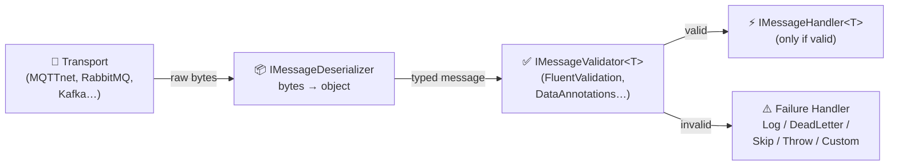

# MessageValidation

A **protocol-agnostic message validation pipeline** for .NET — validate incoming messages from MQTT, RabbitMQ, Kafka, Azure Service Bus, NATS, or any messaging transport with DI integration, pluggable validation, and configurable failure handling.

## Why?

Every message consumer faces the same challenge: raw bytes arrive, you deserialize them, and then you need to **validate** before processing. This logic is duplicated across every protocol and every project.

`MessageValidation` extracts this into a single, reusable pipeline:

```
Raw bytes → Deserialize → Validate → Handle (or dead-letter / log / skip)
```

The core has **zero opinion** on which messaging library or validation framework you use. Bring your own transport, bring your own validator.

## Installation

```bash
dotnet add package MessageValidation
```

## Quick Start

### 1. Define your message

```csharp
public class TemperatureReading
{
    public string SensorId { get; set; } = "";
    public double Value { get; set; }
    public DateTime Timestamp { get; set; }
}
```

### 2. Implement a validator

```csharp
public class TemperatureReadingValidator : IMessageValidator<TemperatureReading>
{
    public Task<MessageValidationResult> ValidateAsync(
        TemperatureReading message, CancellationToken ct = default)
    {
        var errors = new List<MessageValidationError>();

        if (string.IsNullOrWhiteSpace(message.SensorId))
            errors.Add(new("SensorId", "SensorId is required."));

        if (message.Value is < -50 or > 150)
            errors.Add(new("Value", "Value must be between -50 and 150."));

        return Task.FromResult(errors.Count == 0
            ? MessageValidationResult.Success()
            : MessageValidationResult.Failure(errors));
    }
}
```

### 3. Implement a handler

```csharp
public class TemperatureHandler : IMessageHandler<TemperatureReading>
{
    public Task HandleAsync(
        TemperatureReading message, MessageContext context, CancellationToken ct = default)
    {
        // Only reached if validation passed
        Console.WriteLine($"[{context.Source}] Sensor {message.SensorId}: {message.Value}°C");
        return Task.CompletedTask;
    }
}
```

### 4. Implement a deserializer

```csharp
using System.Text.Json;

public class JsonMessageDeserializer : IMessageDeserializer
{
    public object Deserialize(byte[] payload, Type targetType) =>
        JsonSerializer.Deserialize(payload, targetType)
        ?? throw new InvalidOperationException($"Failed to deserialize to {targetType.Name}");
}
```

### 5. Register services

```csharp
builder.Services.AddMessageValidation(options =>
{
    options.MapSource<TemperatureReading>("sensors/+/temperature");
    options.DefaultFailureBehavior = FailureBehavior.Log;
});

builder.Services.AddMessageDeserializer<JsonMessageDeserializer>();
builder.Services.AddScoped<IMessageValidator<TemperatureReading>, TemperatureReadingValidator>();
builder.Services.AddMessageHandler<TemperatureReading, TemperatureHandler>();
```

### 6. Process messages

Feed messages into the pipeline from any transport:

```csharp
var pipeline = serviceProvider.GetRequiredService<IMessageValidationPipeline>();

var context = new MessageContext
{
    Source = "sensors/living-room/temperature",
    RawPayload = payloadBytes
};

await pipeline.ProcessAsync(context);
```

## Core Concepts

### Source Mapping

Map source patterns (topics, queues, routing keys) to message types. Supports MQTT-style wildcards:

| Pattern | Matches |
|---|---|
| `sensors/living-room/temperature` | Exact match only |
| `sensors/+/temperature` | `sensors/kitchen/temperature`, `sensors/bedroom/temperature`, etc. |
| `devices/#` | `devices/abc`, `devices/abc/status`, `devices/abc/status/battery`, etc. |

```csharp
options.MapSource<TemperatureReading>("sensors/+/temperature");
options.MapSource<DeviceHeartbeat>("devices/#");
```

### Failure Behaviors

Configure how validation failures are handled:

| Behavior | Description |
|---|---|
| `Log` | Log the errors and drop the message (default) |
| `DeadLetter` | Route to a dead-letter destination |
| `Skip` | Silently skip the message |
| `ThrowException` | Throw a `MessageValidationException` |
| `Custom` | Delegate to your `IValidationFailureHandler` implementation |

```csharp
options.DefaultFailureBehavior = FailureBehavior.Custom;

// Register your custom handler
builder.Services.AddValidationFailureHandler<MyFailureHandler>();
```

### Abstractions

| Interface | Purpose |
|---|---|
| `IMessageValidationPipeline` | Core pipeline contract (mockable) |
| `IMessageValidator<T>` | Validates a deserialized message |
| `IMessageHandler<T>` | Handles a validated message |
| `IMessageDeserializer` | Converts raw bytes to a typed object |
| `IValidationFailureHandler` | Custom logic when validation fails |

## Architecture

The core library is **transport-agnostic** and **validation-framework-agnostic**. It defines contracts and a pipeline — adapters bring the implementations.

```
MessageValidation-Project/
├── MessageValidation/                          ← Core pipeline (zero opinion)
│   ├── Abstractions/
│   │   ├── IMessageValidationPipeline.cs          IMessageValidationPipeline
│   │   ├── IMessageValidator.cs                  IMessageValidator<T>
│   │   ├── IMessageHandler.cs                    IMessageHandler<T>
│   │   ├── IMessageDeserializer.cs               IMessageDeserializer
│   │   └── IValidationFailureHandler.cs          IValidationFailureHandler
│   ├── Configuration/
│   │   ├── FailureBehavior.cs                    Log | DeadLetter | Skip | Throw | Custom
│   │   └── MessageValidationOptions.cs           Source-to-type mapping + wildcards
│   ├── Diagnostics/
│   │   └── MessageValidationMetrics.cs           System.Diagnostics.Metrics counters
│   ├── Models/
│   │   ├── MessageContext.cs                     Protocol-agnostic envelope
│   │   ├── MessageValidationResult.cs            Validation outcome
│   │   └── MessageValidationError.cs             Single error record
│   ├── Pipeline/
│   │   ├── MessageValidationPipeline.cs          Deserialize → Validate → Dispatch
│   │   └── MessageValidationException.cs         Thrown on FailureBehavior.ThrowException
│   └── DependencyInjection/
│       └── ServiceCollectionExtensions.cs        AddMessageValidation(), AddMessageHandler<,>()
│
├── MessageValidation.DataAnnotations/          ← Validation adapter (DataAnnotations)
│   ├── DataAnnotationsMessageValidator.cs        Bridges DataAnnotations → IMessageValidator<T>
│   └── DependencyInjection/
│       └── ServiceCollectionExtensions.cs        AddMessageDataAnnotationsValidation()
│
├── MessageValidation.FluentValidation/         ← Validation adapter (FluentValidation)
│   ├── FluentValidationMessageValidator.cs       Bridges IValidator<T> → IMessageValidator<T>
│   └── DependencyInjection/
│       └── ServiceCollectionExtensions.cs        AddMessageFluentValidation()
│
├── MessageValidation.MqttNet/                  ← Transport adapter
│   ├── MqttClientExtensions.cs                   IMqttClient.UseMessageValidation()
│   ├── MqttServerExtensions.cs                   MqttServer.UseMessageValidation()
│   └── DependencyInjection/
│       └── ServiceCollectionExtensions.cs        AddMqttNetMessageValidation()
│
├── examples/
│   └── MessageValidation.Example/              ← Runnable console demo
│
└── README.md
```

### Pipeline flow



## Adapter Packages

| Package | Role | Status | Docs |
|---|---|---|---|
| `MessageValidation` | Core pipeline & abstractions | ✅ Available | _this file_ |
| `MessageValidation.FluentValidation` | FluentValidation adapter | ✅ Available | [README](MessageValidation.FluentValidation/README.md) |
| `MessageValidation.MqttNet` | MQTTnet transport hook | ✅ Available | [README](MessageValidation.MqttNet/README.md) |
| `MessageValidation.DataAnnotations` | DataAnnotations adapter | ✅ Available | [README](MessageValidation.DataAnnotations/README.md) |
| `MessageValidation.RabbitMQ` | RabbitMQ transport hook | 🔜 Planned | — |
| `MessageValidation.Kafka` | Kafka transport hook | 🔜 Planned | — |

## Roadmap

- **v0.1** — Core pipeline, abstractions, DI integration, wildcard matching, FluentValidation adapter, MQTTnet transport adapter
- **v0.2** — DataAnnotations adapter, dead-letter support, `System.Diagnostics.Metrics` observability
- **v1.0** — RabbitMQ & Kafka adapters, source generators for AOT
- **v2.0** — Middleware-style pipeline (`Use`, `Map`), Azure Service Bus adapter

## Requirements

- .NET 10+

## Author

- Romain OD
- [@romainod](www.linkedin.com/in/romain-od) | [GitHub](www.github.com/romain-od)
- [🌐 www.devskillsunlock.com](www.devskillsunlock.com)

## License

[MIT](LICENSE)
