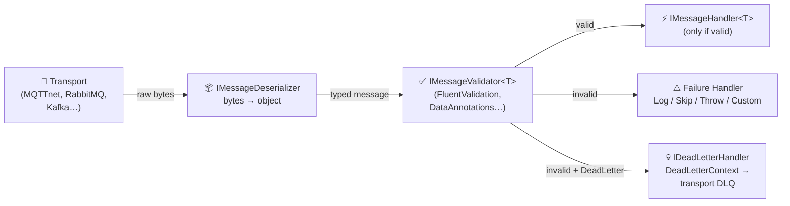

# MessageValidation

A **protocol-agnostic message validation pipeline** for .NET — validate incoming messages from MQTT, RabbitMQ, Kafka, Azure Service Bus, NATS, or any messaging transport with DI integration, pluggable validation, and configurable failure handling.

## Why?

Every message consumer faces the same challenge: raw bytes arrive, you deserialize them, and then you need to **validate** before processing. This logic is duplicated across every protocol and every project.

`MessageValidation` extracts this into a single, reusable pipeline:

```
Raw bytes → Deserialize → Validate → Handle (or dead-letter / log / skip)
```

The core has **zero opinion** on which messaging library or validation framework you use. Bring your own transport, bring your own validator.

## Installation

```bash
dotnet add package MessageValidation
```

## Quick Start

### 1. Define your message

```csharp
public class TemperatureReading
{
    public string SensorId { get; set; } = "";
    public double Value { get; set; }
    public DateTime Timestamp { get; set; }
}
```

### 2. Implement a validator

```csharp
public class TemperatureReadingValidator : IMessageValidator<TemperatureReading>
{
    public Task<MessageValidationResult> ValidateAsync(
        TemperatureReading message, CancellationToken ct = default)
    {
        var errors = new List<MessageValidationError>();

        if (string.IsNullOrWhiteSpace(message.SensorId))
            errors.Add(new("SensorId", "SensorId is required."));

        if (message.Value is < -50 or > 150)
            errors.Add(new("Value", "Value must be between -50 and 150."));

        return Task.FromResult(errors.Count == 0
            ? MessageValidationResult.Success()
            : MessageValidationResult.Failure(errors));
    }
}
```

### 3. Implement a handler

```csharp
public class TemperatureHandler : IMessageHandler<TemperatureReading>
{
    public Task HandleAsync(
        TemperatureReading message, MessageContext context, CancellationToken ct = default)
    {
        // Only reached if validation passed
        Console.WriteLine($"[{context.Source}] Sensor {message.SensorId}: {message.Value}°C");
        return Task.CompletedTask;
    }
}
```

### 4. Implement a deserializer

```csharp
using System.Text.Json;

public class JsonMessageDeserializer : IMessageDeserializer
{
    public object Deserialize(byte[] payload, Type targetType) =>
        JsonSerializer.Deserialize(payload, targetType)
        ?? throw new InvalidOperationException($"Failed to deserialize to {targetType.Name}");
}
```

### 5. Register services

```csharp
builder.Services.AddMessageValidation(options =>
{
    options.MapSource<TemperatureReading>("sensors/+/temperature");
    options.DefaultFailureBehavior = FailureBehavior.Log;
});

builder.Services.AddMessageDeserializer<JsonMessageDeserializer>();
builder.Services.AddScoped<IMessageValidator<TemperatureReading>, TemperatureReadingValidator>();
builder.Services.AddMessageHandler<TemperatureReading, TemperatureHandler>();
```

### 6. Process messages

Feed messages into the pipeline from any transport:

```csharp
var pipeline = serviceProvider.GetRequiredService<IMessageValidationPipeline>();

var context = new MessageContext
{
    Source = "sensors/living-room/temperature",
    RawPayload = payloadBytes
};

await pipeline.ProcessAsync(context);
```

## Core Concepts

### Source Mapping

Map source patterns (topics, queues, routing keys) to message types. Supports MQTT-style wildcards:

| Pattern | Matches |
|---|---|
| `sensors/living-room/temperature` | Exact match only |
| `sensors/+/temperature` | `sensors/kitchen/temperature`, `sensors/bedroom/temperature`, etc. |
| `devices/#` | `devices/abc`, `devices/abc/status`, `devices/abc/status/battery`, etc. |

```csharp
options.MapSource<TemperatureReading>("sensors/+/temperature");
options.MapSource<DeviceHeartbeat>("devices/#");
```

### Failure Behaviors

Configure how validation failures are handled:

| Behavior | Description |
|---|---|
| `Log` | Log the errors and drop the message (default) |
| `DeadLetter` | Route to a dead-letter destination via `IDeadLetterHandler` |
| `Skip` | Silently skip the message |
| `ThrowException` | Throw a `MessageValidationException` |
| `Custom` | Delegate to your `IValidationFailureHandler` implementation |

```csharp
options.DefaultFailureBehavior = FailureBehavior.Custom;

// Register your custom handler
builder.Services.AddValidationFailureHandler<MyFailureHandler>();
```

### Dead-Letter Queue

When `FailureBehavior.DeadLetter` is configured, the pipeline computes a dead-letter destination from `DeadLetterPrefix + Source` and delegates to an `IDeadLetterHandler`:

```csharp
options.DefaultFailureBehavior = FailureBehavior.DeadLetter;
options.DeadLetterPrefix = "$dead-letter/"; // default — customize as needed

// Register your dead-letter handler
builder.Services.AddDeadLetterHandler<MyDeadLetterHandler>();
```

Implement the handler to publish the failed message to your transport's dead-letter destination:

```csharp
public class MyDeadLetterHandler : IDeadLetterHandler
{
    public Task HandleAsync(DeadLetterContext context, CancellationToken ct = default)
    {
        // context.Destination       → "$dead-letter/sensors/room1/temperature"
        // context.OriginalContext    → the original MessageContext (source, payload, metadata)
        // context.ValidationResult  → the validation errors
        // context.Timestamp         → UTC time of the dead-letter decision
        Console.WriteLine($"Dead-lettering to {context.Destination}");
        return Task.CompletedTask;
    }
}
```

**Resolution priority:** When `DeadLetter` is active, the pipeline resolves handlers in this order:
1. `IDeadLetterHandler` — preferred (receives full `DeadLetterContext` with computed destination)
2. `IValidationFailureHandler` — backward-compatible fallback
3. Log warning — graceful degradation if no handler is registered

### Abstractions

| Interface | Purpose |
|---|---|
| `IMessageValidationPipeline` | Core pipeline contract (mockable) |
| `IMessageValidator<T>` | Validates a deserialized message |
| `IMessageHandler<T>` | Handles a validated message |
| `IMessageDeserializer` | Converts raw bytes to a typed object |
| `IValidationFailureHandler` | Custom logic when validation fails |
| `IDeadLetterHandler` | Handles dead-lettered messages (receives `DeadLetterContext`) |
| `IMessageMiddleware` | Composable pipeline stage (v2.0+) — see [Middleware pipeline](#middleware-pipeline-v20) |

## Architecture

The core library is **transport-agnostic** and **validation-framework-agnostic**. It defines contracts and a pipeline — adapters bring the implementations.

```
MessageValidation-Project/
├── MessageValidation/                          ← Core pipeline (zero opinion)
│   ├── Abstractions/
│   │   ├── IMessageValidationPipeline.cs          IMessageValidationPipeline
│   │   ├── IMessageValidator.cs                  IMessageValidator<T>
│   │   ├── IMessageHandler.cs                    IMessageHandler<T>
│   │   ├── IMessageDeserializer.cs               IMessageDeserializer
│   │   ├── IValidationFailureHandler.cs          IValidationFailureHandler
│   │   └── IDeadLetterHandler.cs                 IDeadLetterHandler
│   ├── Configuration/
│   │   ├── FailureBehavior.cs                    Log | DeadLetter | Skip | Throw | Custom
│   │   └── MessageValidationOptions.cs           Source-to-type mapping + wildcards
│   ├── Diagnostics/
│   │   └── MessageValidationMetrics.cs           System.Diagnostics.Metrics counters
│   ├── Models/
│   │   ├── MessageContext.cs                     Protocol-agnostic envelope
│   │   ├── MessageValidationResult.cs            Validation outcome
│   │   ├── MessageValidationError.cs             Single error record
│   │   └── DeadLetterContext.cs                  Dead-letter envelope (destination, errors, timestamp)
│   ├── Pipeline/
│   │   ├── MessageValidationPipeline.cs          Builds + invokes the middleware chain
│   │   ├── MessageDelegate.cs                    (ctx, ct) => Task
│   │   ├── IMessageMiddleware.cs                 Middleware contract
│   │   ├── IMessagePipelineBuilder.cs            Use / UseMiddleware<T> / Map / Build
│   │   ├── MessagePipelineBuilder.cs             Default builder implementation
│   │   ├── MessageValidationException.cs         Thrown on FailureBehavior.ThrowException
│   │   └── Middleware/                           Built-in stages (Metrics, TypeResolution,
│   │                                              Deserialization, Validation,
│   │                                              FailureHandling, HandlerDispatch)
│   └── DependencyInjection/
│       └── ServiceCollectionExtensions.cs        AddMessageValidation(), AddMessageHandler<,>(), AddDeadLetterHandler<>()
│
├── MessageValidation.DataAnnotations/          ← Validation adapter (DataAnnotations)
│   ├── DataAnnotationsMessageValidator.cs        Bridges DataAnnotations → IMessageValidator<T>
│   └── DependencyInjection/
│       └── ServiceCollectionExtensions.cs        AddMessageDataAnnotationsValidation()
│
├── MessageValidation.FluentValidation/         ← Validation adapter (FluentValidation)
│   ├── FluentValidationMessageValidator.cs       Bridges IValidator<T> → IMessageValidator<T>
│   └── DependencyInjection/
│       └── ServiceCollectionExtensions.cs        AddMessageFluentValidation()
│
├── MessageValidation.MqttNet/                  ← Transport adapter (MQTTnet)
│   ├── MqttClientExtensions.cs                   IMqttClient.UseMessageValidation()
│   ├── MqttServerExtensions.cs                   MqttServer.UseMessageValidation()
│   └── DependencyInjection/
│       └── ServiceCollectionExtensions.cs        AddMqttNetMessageValidation()
│
├── MessageValidation.RabbitMQ/                 ← Transport adapter (RabbitMQ.Client)
│   ├── RabbitMqChannelExtensions.cs              IChannel.UseMessageValidation()
│   └── DependencyInjection/
│       └── ServiceCollectionExtensions.cs        AddRabbitMqMessageValidation()
│
├── MessageValidation.Kafka/                    ← Transport adapter (Confluent.Kafka)
│   ├── KafkaConsumerExtensions.cs                IConsumer<string, byte[]>.StartConsuming()
│   └── DependencyInjection/
│       └── ServiceCollectionExtensions.cs        AddKafkaMessageValidation()
│
├── MessageValidation.AzureServiceBus/          ← Transport adapter (Azure.Messaging.ServiceBus)
│   ├── ServiceBusProcessorExtensions.cs          ServiceBusProcessor.UseMessageValidation()
│   └── DependencyInjection/
│       └── ServiceCollectionExtensions.cs        AddAzureServiceBusMessageValidation()
│
├── MessageValidation.AzureEventHubs/           ← Transport adapter (Azure.Messaging.EventHubs)
│   ├── EventProcessorClientExtensions.cs         EventProcessorClient.UseMessageValidation()
│   ├── EventHubConsumerClientExtensions.cs       EventHubConsumerClient.StartConsuming()
│   ├── EventDataContextFactory.cs                EventData → MessageContext
│   └── DependencyInjection/
│       └── ServiceCollectionExtensions.cs        AddAzureEventHubsMessageValidation()
│
├── MessageValidation.NatsNet/                  ← Transport adapter (NATS.Net)
│   ├── NatsConnectionExtensions.cs               INatsConnection.SubscribeWithMessageValidationAsync()
│   └── DependencyInjection/
│       └── ServiceCollectionExtensions.cs        AddNatsNetMessageValidation()
│
├── examples/
│   └── MessageValidation.Example/              ← Runnable console demo
│
└── README.md
```

### Pipeline flow



## Middleware pipeline (v2.0+)

Starting with v2.0, the pipeline is composed of **middleware** — mirroring the
ASP.NET Core `IApplicationBuilder` shape. The default stack (metrics →
type resolution → deserialization → validation → failure handling → handler
dispatch) is registered automatically, and you can insert your own stages with
`Use`, `UseMiddleware<T>`, or branch with `Map`.

### Custom inline middleware

```csharp
services.AddMessageValidation(
    options =>
    {
        options.MapSource<TemperatureReading>("sensors/+/temperature");
    },
    pipeline =>
    {
        // Log every message before the built-in stages run
        pipeline.Use(next => async (ctx, ct) =>
        {
            Console.WriteLine($"[in] {ctx.Source} ({ctx.RawPayload.Length} bytes)");
            await next(ctx, ct);
        });

        MessageValidationPipeline.ConfigureDefaults(pipeline);
    });
```

### Strongly-typed middleware

```csharp
public sealed class CorrelationIdMiddleware(ILogger<CorrelationIdMiddleware> logger)
    : IMessageMiddleware
{
    public async Task InvokeAsync(MessageContext ctx, MessageDelegate next, CancellationToken ct)
    {
        ctx.Items["CorrelationId"] = Guid.NewGuid().ToString("N");
        using (logger.BeginScope("CID:{Cid}", ctx.Items["CorrelationId"]))
            await next(ctx, ct);
    }
}

services.AddMessageValidation(
    options => options.MapSource<TemperatureReading>("sensors/+/temperature"),
    pipeline =>
    {
        pipeline.UseMiddleware<CorrelationIdMiddleware>();
        MessageValidationPipeline.ConfigureDefaults(pipeline);
    });
```

### Branching with `Map`

```csharp
pipeline.Map(
    ctx => ctx.Source.StartsWith("audit/"),
    auditBranch =>
    {
        auditBranch.UseMiddleware<AuditLoggingMiddleware>();
        MessageValidationPipeline.ConfigureDefaults(auditBranch);
    });

// Non-"audit/..." messages fall through to the outer pipeline
MessageValidationPipeline.ConfigureDefaults(pipeline);
```

`Map` executes the branch and **skips the remainder of the outer pipeline**
when the predicate returns `true`, just like `IApplicationBuilder.Map`.

## Adapter Packages

| Package | Role | Status | Docs |
|---|---|---|---|
| `MessageValidation` | Core pipeline & abstractions | ✅ Available | _this file_ |
| `MessageValidation.FluentValidation` | FluentValidation adapter | ✅ Available | [README](MessageValidation.FluentValidation/README.md) |
| `MessageValidation.MqttNet` | MQTTnet transport hook | ✅ Available | [README](MessageValidation.MqttNet/README.md) |
| `MessageValidation.DataAnnotations` | DataAnnotations adapter | ✅ Available | [README](MessageValidation.DataAnnotations/README.md) |
| `MessageValidation.RabbitMQ` | RabbitMQ transport hook | ✅ Available | [README](MessageValidation.RabbitMQ/README.md) |
| `MessageValidation.Kafka` | Kafka transport hook (Confluent) | ✅ Available | [README](MessageValidation.Kafka/README.md) |
| `MessageValidation.AzureServiceBus` | Azure Service Bus transport hook | ✅ Available | [README](MessageValidation.AzureServiceBus/README.md) |
| `MessageValidation.AzureEventHubs` | Azure Event Hubs transport hook | ✅ Available | [README](MessageValidation.AzureEventHubs/README.md) |
| `MessageValidation.NatsNet` | NATS transport hook (NATS.Net) | ✅ Available | [README](MessageValidation.NatsNet/README.md) |

## Roadmap

- **v0.1** — Core pipeline, abstractions, DI integration, wildcard matching, FluentValidation adapter, MQTTnet transport adapter
- **v0.2** — DataAnnotations adapter, `System.Diagnostics.Metrics` observability
- **v0.3** — Dead-letter queue support (`IDeadLetterHandler`, `DeadLetterContext`, dead-letter metrics, backward-compatible fallback)
- **v1.0** — RabbitMQ & Kafka adapters
- **v1.1** — Azure Service Bus adapter (`ServiceBusProcessor` / `ServiceBusSessionProcessor`, passwordless auth)
- **v1.2** — Azure Event Hubs adapter (`EventProcessorClient` / `EventHubConsumerClient`, passwordless auth)
- **v2.0** — Middleware-style pipeline (`Use`, `Map`, `IMessageMiddleware`), NATS adapter ✅

## Requirements

- .NET 10+

## Author

- Romain OD
- [@romainod](www.linkedin.com/in/romain-od) | [GitHub](www.github.com/romain-od)
- [🌐 www.devskillsunlock.com](www.devskillsunlock.com)

## License

[MIT](LICENSE)
